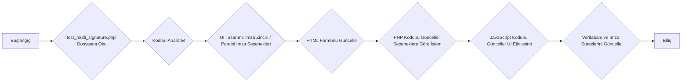

# Detaylı Plan

**Adımlar:**

1.  **`test_multi_signature.php` Dosyasını Oku:** Dosyanın içeriğini okuyarak mevcut yapıyı ve kodları analiz ettim.
2.  **Kodları Analiz Et:** Mevcut imza zinciri ve paralel imza desteğinin nasıl çalıştığını detaylıca inceledim.
3.  **UI Tasarımı: İmza Zinciri / Paralel İmza Seçenekleri:** Kullanıcının imza zinciri veya paralel imza seçeneklerinden birini seçebileceği bir kullanıcı arayüzü tasarlayacağım.
4.  **HTML Formunu Güncelle:** Tasarladığım kullanıcı arayüzünü HTML formuna entegre edeceğim.
5.  **PHP Kodunu Güncelle: Seçeneklere Göre İşlem:** Kullanıcının seçtiği seçeneğe göre imza zinciri veya paralel imza süreçlerini başlatacak veya yönetecek PHP kodlarını yazacağım.
6.  **JavaScript Kodunu Güncelle: UI Etkileşimi:** Kullanıcı arayüzü ile etkileşimi sağlayacak JavaScript kodlarını yazacağım.
7.  **Veritabanı ve İmza Süreçlerini Güncelle:** Veritabanında gerekli güncellemeleri yapacak ve imza süreçlerini yeni yapıya göre ayarlayacağım.